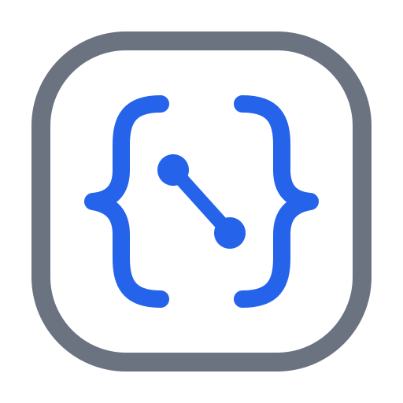
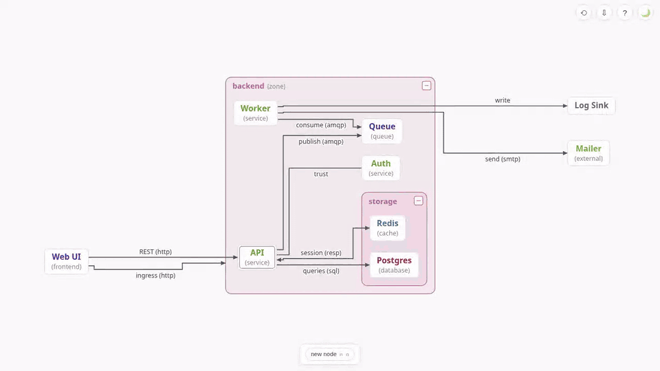

#  simpleviz

Minimal EDN-driven graph visualization. Describe nodes, directed edges, and
nested grouping boxes in an EDN file; view it as an auto-layouted canvas diagram
that live-reloads while you edit the file.

## Install

Linux, with [babashka](https://babashka.org/), curl and tar:

    curl -fsSL https://raw.githubusercontent.com/sstoehrm/simpleviz/main/install.sh | bash

This installs into `~/.simpleviz` and puts a launcher in `~/.local/bin`.
`simpleviz update` fetches the latest release.

Without the installer, unpack a tarball from the
[releases page](https://github.com/sstoehrm/simpleviz/releases) and run
`bb serve examples/demo.edn` inside it (port 7373; `--port N` changes it).

## Usage

    simpleviz ~/.simpleviz/examples/demo.edn   # serve a graph on a free port 7370-7469
    simpleviz init my-arch.edn                 # write a starter file
    simpleviz fork my-arch.edn next            # copy to my-arch-next.edn, plus every file it refs
    simpleviz my-arch.edn next                 # compare my-arch.edn → my-arch-next.edn
    simpleviz promote my-arch.edn next         # make the forks the new originals

`simpleviz --help` lists the rest. Edit the file and the page follows. You
can also edit in the page: click an element to inspect and change its
attributes, and use the toolbar at the bottom to add, connect, group and
delete. ⇩ exports a PNG with the source embedded, which simpleviz serves like
an EDN file. Press `?` in the page for controls and shortcuts.

The [guide](https://github.com/sstoehrm/simpleviz/blob/main/docs/guide.md)
covers comparing, editing, refs between graphs, exporting and write locks.

## Data format

    {:nodes {:api {:name "API"           ; display name (defaults to the key)
                   :type "service"       ; free-form; colors the name, shown as (type)
                   :lang "clojure"       ; any other attr: inspector panel only
                   :ref "sub/api.edn"    ; another graph file, relative to this one — "follow ref" opens it;
                                         ; the node gets a double border
                   :state :in-progress}  ; :new | :in-progress | :blocked | :done — a mark on the node's corner
             :web {:type "frontend"}
             :db  {:type "database"}}
     :edges {[:web :api]                 ; key: endpoints (nodes or boxes), order defines left/right;
                                         ; the same edge cannot appear twice
             {:direction :->             ; :-> | :<- | :<-> | :- (default :-)
              :name "REST"
              :type "http"}}
     :boxes {:backend                    ; key is the box id
             {:name "Backend"            ; display name (defaults to the key)
              :type "zone"               ; colors the box (separate palette)
              :components #{:api :db}}}} ; node and/or box ids; boxes nest

Identifiers may be keywords or strings. An invalid element is skipped with a
warning banner instead of breaking the render. The
[guide](https://github.com/sstoehrm/simpleviz/blob/main/docs/guide.md#data-format)
has the full rules.

## Claude Code and Codex plugins

This repo is a plugin marketplace. Its skill teaches the agent the graph
format and the CLI, so it can write and serve diagrams for you.

Claude Code:

    /plugin marketplace add sstoehrm/simpleviz
    /plugin install simpleviz@simpleviz

Codex:

    codex plugin marketplace add sstoehrm/simpleviz
    codex plugin add simpleviz@simpleviz

## Bug reports

Run with `--debug` to log every edit and error to `~/.simpleviz/logs/`.
Crashes are logged there even without it. Attach the logs to the report.

## Development

See [docs/development.md](https://github.com/sstoehrm/simpleviz/blob/main/docs/development.md).
